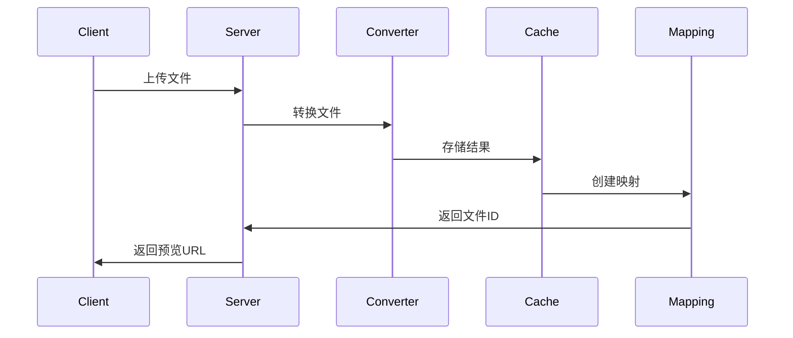
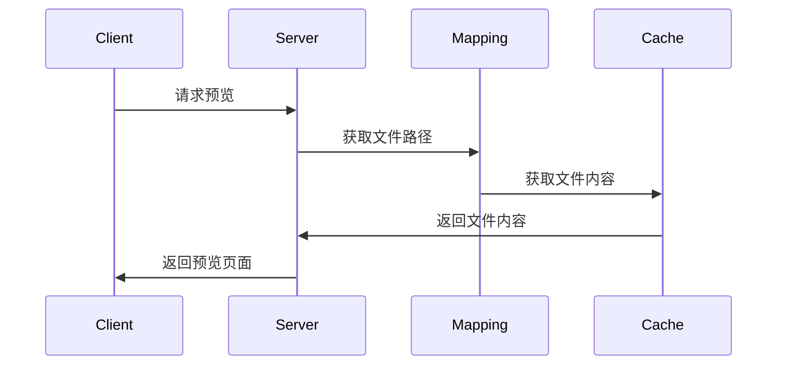

# 项目架构

本文档详细介绍了 File Preview 项目的架构设计。

## 整体架构

File Preview 采用模块化设计，主要包含以下几个核心模块：

```
file_preview/
├── cli/                # 命令行接口
├── core/               # 核心功能模块
│   ├── converter/      # 文件转换器
│   ├── cache/         # 缓存管理
│   └── utils/         # 工具函数
├── server/            # Web 服务器
│   ├── routes/        # 路由处理
│   └── views/         # 视图模板
├── tests/             # 测试代码
└── config/            # 配置文件
```

## 核心模块

### 1. 文件转换器 (converter)

负责将各种格式的文件转换为 PDF。

```python
class FileConverter:
    def convert(self, input_path: str, output_path: str) -> bool:
        """
        将输入文件转换为 PDF
        """
        pass

    def convert_url(self, url: str, output_path: str) -> bool:
        """
        将网络文件转换为 PDF
        """
        pass
```

### 2. 缓存管理 (cache)

管理文件转换结果的缓存。

```python
class CacheManager:
    def get(self, key: str) -> Optional[bytes]:
        """
        获取缓存内容
        """
        pass

    def put(self, key: str, value: bytes) -> bool:
        """
        存储缓存内容
        """
        pass

    def delete(self, key: str) -> bool:
        """
        删除缓存内容
        """
        pass
```

### 3. 文件映射 (mapping)

管理文件 ID 和实际文件路径的映射关系。

```python
class FileMapping:
    def add(self, file_id: str, file_path: str, original_name: str) -> bool:
        """
        添加文件映射
        """
        pass

    def get(self, file_id: str) -> Optional[str]:
        """
        获取文件路径
        """
        pass

    def get_original_name(self, file_id: str) -> Optional[str]:
        """
        获取原始文件名
        """
        pass
```

## 数据流

### 1. 文件转换流程



### 2. 文件预览流程



## 配置系统

配置文件采用 YAML 格式，支持以下配置项：

```yaml
server:
  host: 127.0.0.1
  port: 5000
  max_content_length: 104857600

directories:
  cache: cache
  download: download
  convert: convert
  log: log

conversion:
  supported_formats:
    - .doc
    - .docx
    - .xls
    - .xlsx
    - .ppt
    - .pptx
  max_retries: 3
  timeout: 300

cache:
  enabled: true
  max_size: 1073741824
  retention_days: 7

logging:
  level: INFO
  format: "%(asctime)s - %(name)s - %(levelname)s - %(message)s"
  file: file_preview.log
```

## 错误处理

系统采用统一的错误处理机制：

```python
class FilePreviewError(Exception):
    """基础错误类"""
    pass

class ConversionError(FilePreviewError):
    """转换错误"""
    pass

class CacheError(FilePreviewError):
    """缓存错误"""
    pass

class MappingError(FilePreviewError):
    """映射错误"""
    pass
```

## 日志系统

使用 Python 标准库的 logging 模块进行日志记录：

```python
import logging

logger = logging.getLogger('file_preview')
logger.setLevel(logging.INFO)

# 文件处理器
file_handler = logging.FileHandler('file_preview.log')
file_handler.setFormatter(logging.Formatter(
    '%(asctime)s - %(name)s - %(levelname)s - %(message)s'
))
logger.addHandler(file_handler)

# 控制台处理器
console_handler = logging.StreamHandler()
console_handler.setFormatter(logging.Formatter(
    '%(asctime)s - %(levelname)s - %(message)s'
))
logger.addHandler(console_handler)
```

## 测试策略

### 1. 单元测试

- 使用 pytest 框架
- 测试覆盖率要求 > 90%
- 主要测试核心功能模块

### 2. 集成测试

- 测试模块间的交互
- 测试完整的文件转换流程
- 测试错误处理机制

### 3. 性能测试

- 测试并发处理能力
- 测试大文件处理性能
- 测试缓存效率

## 部署架构

### 1. 单机部署

适用于小型应用场景：

```
Client -> Nginx -> File Preview Server
```

### 2. 集群部署

适用于高并发场景：

```
Client -> Load Balancer -> [File Preview Server 1, File Preview Server 2, ...]
                          -> Shared Cache
                          -> Shared Storage
```

## 安全考虑

1. 文件上传限制
   - 文件大小限制
   - 文件类型限制
   - 文件名验证

2. 访问控制
   - 请求频率限制
   - IP 白名单
   - 认证机制

3. 数据安全
   - 临时文件清理
   - 敏感信息加密
   - 日志脱敏

## 性能优化

1. 缓存优化
   - 多级缓存
   - 缓存预热
   - 缓存淘汰策略

2. 并发处理
   - 异步处理
   - 连接池
   - 资源限制

3. 存储优化
   - 文件分片
   - 压缩存储
   - 定期清理

## 监控告警

1. 系统监控
   - CPU 使用率
   - 内存使用率
   - 磁盘使用率

2. 业务监控
   - 转换成功率
   - 平均响应时间
   - 并发请求数

3. 告警机制
   - 阈值告警
   - 异常告警
   - 恢复通知

## 扩展性设计

1. 插件系统
   - 转换器插件
   - 存储插件
   - 认证插件

2. 配置扩展
   - 环境变量覆盖
   - 配置文件继承
   - 动态配置更新

3. API 扩展
   - RESTful API
   - WebSocket API
   - GraphQL API

## 维护建议

1. 代码维护
   - 定期代码审查
   - 依赖更新
   - 技术债务清理

2. 文档维护
   - API 文档更新
   - 使用文档更新
   - 架构文档更新

3. 运维维护
   - 日志分析
   - 性能优化
   - 安全加固 